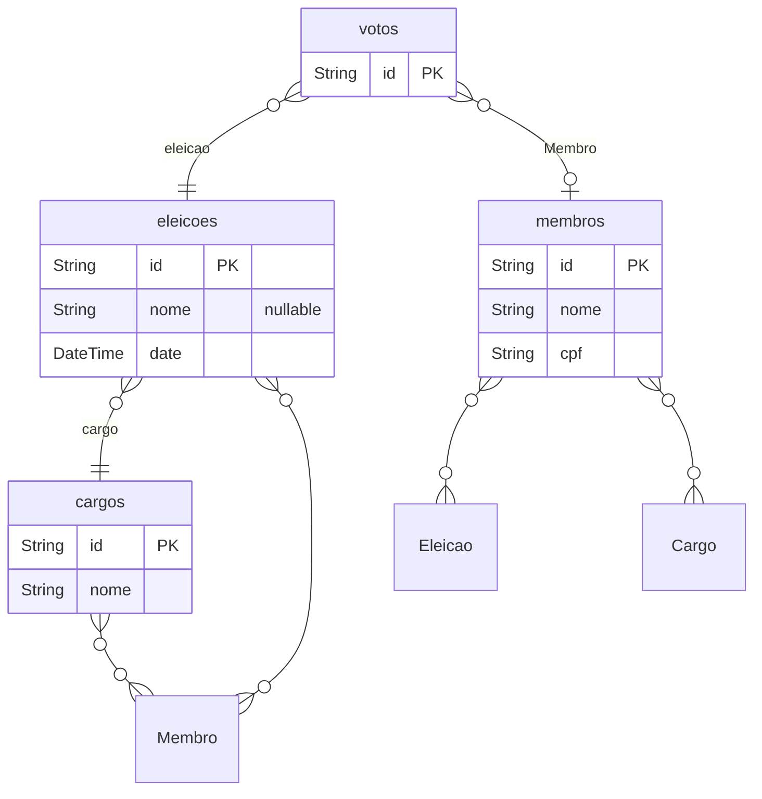

```mermaid
erDiagram

  membros {
    String id PK 
    String nome  
    String cpf  
    }
  

  cargos {
    String id PK 
    String nome  
    }
  

  eleicoes {
    String id PK 
    String nome  "nullable"
    DateTime date  
    }
  

  votos {
    String id PK 
    }
  
    membros o{--}o Eleicao : ""
    membros o{--}o Cargo : ""
    cargos o{--}o Membro : ""
    eleicoes o{--|| cargos : "cargo"
    eleicoes o{--}o Membro : ""
    votos o{--|| eleicoes : "eleicao"
    votos o{--|o membros : "Membro"
```
